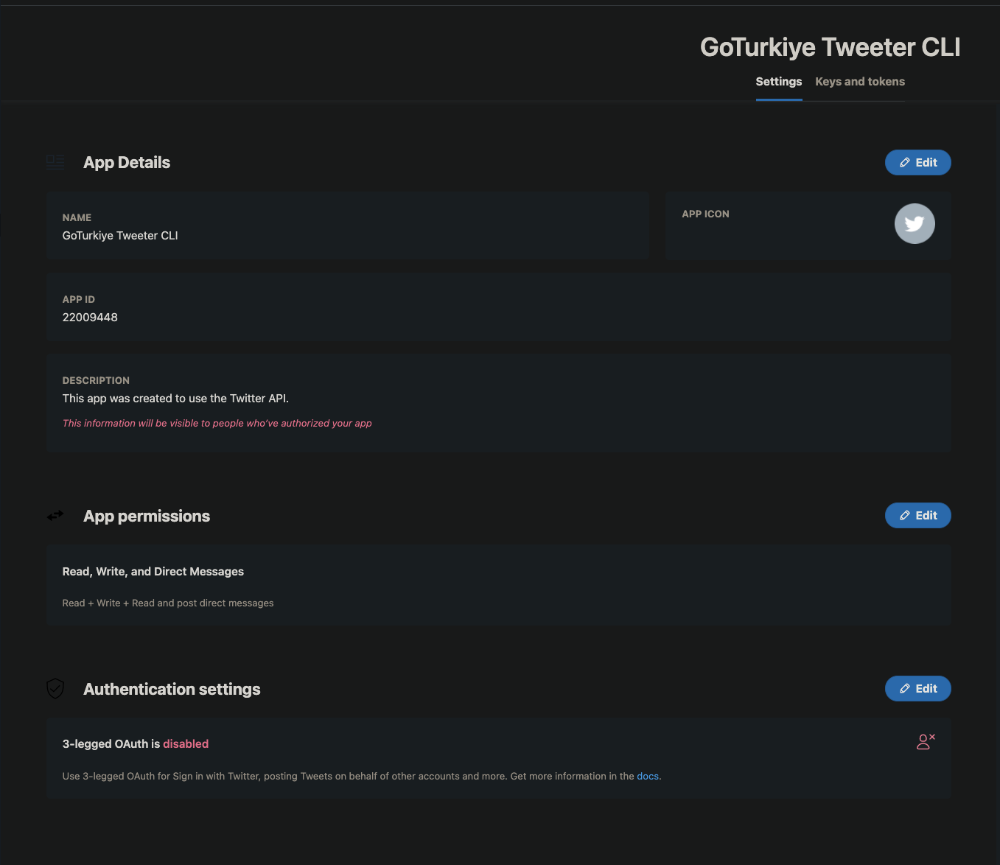

<div align="center">
  
  <h3 align="center">gt-tweeter</h3>
  <p align="center">A helper CLI that facilitates to manage Twitter account from terminal</p>

</div>

---

[](https://asciinema.org/a/JASrDapMHcE40P5OvXFEQZMyt)

---

## Installation

### Go

If you have Go 1.16+, you can directly install by running:

```shell
$ go install github.com/GoTurkiye/training/104-cli/gt-tweeter@latest
```

and the resulting binary will be placed at **_$HOME/go/bin/gt-tweeter_**.

## Quick Start

```shell
$ gt-tweeter --help
gt-tweeter is a CLI library for Go that facilitates to use Twitter from your terminal.
It basically shows account information, list and get followers, or event you can send tweet, and
display the status of the tweet.

Usage:
  gt-tweeter [command]

Available Commands:
  account     Helps you to view account information
  completion  Generate completion script
  follower    Helps you to list and get followers
  help        Help about any command
  tweet       Helps you to send tweet and show the status of the tweet

Flags:
  -c  --config string   config file (default is $HOME/.gt-tweeter.yaml)
  -h, --help            help for gt-tweeter

Use "gt-tweeter [command] --help" for more information about a command.
```

## FAQ

### How to get Twitter API consumer and secret keys?

To get Consumer Key & Consumer Secret, you have to create an app in Twitter via

👉 https://developer.twitter.com/en/apps

Then you'll be taken to a page containing Consumer Key & Consumer Secret.



Hopefully this information will clarify OAuth essentials for Twitter:

1. Create a Twitter account if you don't already have one
2. Visit 'https://apps.twitter.com' and follow the required prompts to create a developer project (Twitter requires you
   to answer some questions before they will approve your account. Approval was nearly instant in my case.)
3. Requesting the API key and secret via the Developer Portal causes Twitter to produce the following three things:
    * API key (this is your 'consumer key')
    * API secret key (this is your 'consumer secret')
    * Bearer token
4. Next, visit the 'Authentication Tokens' area of the Developer Portal and generate an 'Access token & secret'. This
   will provide you with the following two items:
    * Access token (this is your 'token key')
    * Access token secret (this is your 'token secret')
5. The consumer key, consumer secret, token key, and token secret should be sufficient to do Twitter API calls (they
   were for me). Good luck!

> Credit: https://stackoverflow.com/questions/1808855/getting-new-twitter-api-consumer-and-secret-keys
