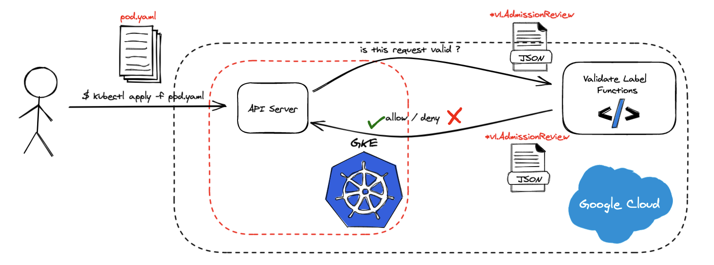

## GopherCon Turkiye 2021 - Kubernetes'i kendi ihtiyaçlarımıza göre nasıl özelleştirdik ?



### Prerequisites

* gcloud 342.0.0
* Kubernetes v1.19.9
* kubectl v1.21.1

### Tutorial

Start with defining the name of GKE (Google Kubernetes Engine) Cluster as an environment variable.

```bash
$ export GKE_DEMO_CLUSTER_NAME=gophercon-turkiye-2021-hands-on
```

Let's create the GKE Cluster.
```bash
$ gcloud container clusters create $GKE_DEMO_CLUSTER_NAME --num-nodes=2
```

Once it's created, fetch the cluster credentials in order to work properly with `kubectl` a CLI tool for interacting with Kubernetes.
```bash
$ gcloud container clusters get-credentials $GKE_DEMO_CLUSTER_NAME
```

Verify if everything is working before move on to the next step.

```bash
$ kubectl get nodes -o wide
```

Now, it is time for deploying our first Google Cloud Function.

```bash
$ gcloud deploy functions Validate --runtime go113 --trigger-http --allow-unauthenticated
```

Once it's deployed, let's grap the url of the function for later use.
```bash
$ CLOUD_FUNCTION_URL=$(gcloud functions describe --format=json Validate | jq -r '.httpsTrigger.url')
$ echo $CLOUD_FUNCTION_URL
```

Now we are ready to register this functions as a `ValidatingWebhookConfiguration` in our cluster.

```bash
$ cat <<EOF | k apply -f -
apiVersion: admissionregistration.k8s.io/v1
kind: ValidatingWebhookConfiguration
metadata:
 name: validatelabel
webhooks:
- name: us-central1-developerguy-311909.cloudfunctions.net
  clientConfig:
    url: $CLOUD_FUNCTION_URL
  rules:
  - apiGroups: [""]
    apiVersions: ["v1"]
    resources: ["pods"]
    operations: ["CREATE"]
    scope: Namespaced
  namespaceSelector:
    matchLabels:
      gophercon.turkiye/validation: enabled
  admissionReviewVersions: ["v1"]
  sideEffects: None
  failurePolicy: Fail
EOF
```

### Test

There are two manifests in the repo, one involves valid Pod manifest, and the other one involves invalid Pod manifest.

Before applying them, we should add a `gophercon.turkiye/validation` label to the namespace with the value `enabled`.

```bash
$ kubectl label namespace default gophercon.turkiye/validation=enabled
```

Let's apply the invalid one first.
```bash
$ kubectl apply --filename pod-invalid.yaml
```

Let's apply the valid one.
```bash
$ kubectl apply --filename pod-valid.yaml
```

### Furhermore

If you want to deploy your own Kubernetes Admission Webhook without using Google Cloud Functions, you have to manage your own TLS Certificates, because of Kubernetes API Server can establish only TLS connection with the webhook, this means that you have to run your webhook on port `443`, or at least forward your webhook server from port `443`. There are various options to do that, one is managing self-signed CA certificates, and another option is creating certificates based on Kubernetes CA. 

To get more detail about them, you can take a look at our solution called [k8s-webhook-certificator](https://github.com/Trendyol/k8s-webhook-certificator).
