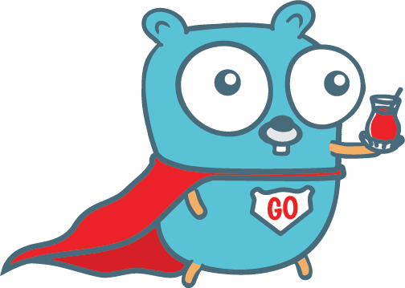

<b>🇹🇷 Go Türkiye 🇹🇷</b>

# Go Türkiye Eğitim Kampı

Go programlama dilini anlatmayı ve öğretmeyi hedeflediğimiz eğitim kampının akışını, örnek kodları ve etkinlik kayıtlarını burada bulabilirsin. Bu repo eğitim boyunca güncellenecek olup sende bu repoya katkı sağlayabilirsin.

## İçerik

* [Basics](#) [18.09.2021 20:30]
	* [Variables](#)
	* [Array](#)
    * [Slices](#)
    * [Maps](#)
    * [Strings](#)
    * [Loops](#)
    * [Interfaces](#)
    * [Structs](#)
    * [Modules](#)
    * [Functions](#)
    * [Errors](#)
    * [Pointers](#)

* [Concurrency](#) [19.09.2021 20:30]
	* [Go Routines](#)
	* [Channels](#)
    * [Slices](#)
    * [WaitGroups](#)
    * [Mutex](#)
    * [SyncPool](#)
    * [Dead Lock](#)

* [Concurrency](#) [19.09.2021 20:30]
	* [Go Routines](#)
	* [Channels](#)
    * [Slices](#)
    * [WaitGroups](#)
    * [Mutex](#)
    * [SyncPool](#)
    * [Dead Lock](#)

* [Http Package](#) [21.09.2021 20:30]
	* [http](#)
	* [httputil](#)
    * [grpc](#)
    * [Reverse Proxy](#)
    * [Restful Api](#)
    * [Web Frameworks (echo, gin, fasthttp)](#)

* [I/O](#) [22.09.2021 20:30]
	* [File ops.](#)
	* [Network ops.](#)
    * [Bytes](#)
    * [io.Reader](#)
    * [io.Writer](#)
    * [io.TeeReader](#)
    * [io.MultiWriter](#)

* [CLI](#) [23.09.2021 20:30]
	* [Flags](#)
	* [Environments](#)
    * [Bytes](#)
    * [Variables](#)
    * [Parameters](#)
    * [Commands](#)

* [Test & Benchmarks](#) [25.09.2021 20:30]
	* [Unit Test](#)
	* [Benchmark Test](#)
    * [Tracing](#)
    * [Profiling](#)

* [Algorithms](#) [26.09.2021 20:30]
	* [Sorting](#)
	* [LinkedList](#)
    * [Stack](#)
    * [Queue](#)
    * [Tree](#)
    * [Graphs](#)
    * [Dynamic Programming](#)

* [Database](#) [28.09.2021 20:30]
	* [Sql Queries](#)
	* [Transactions](#)
    * [CRUD Operations](#)
    * [Couchbase Ops](#)

* [External Communication](#) [29.09.2021 20:30]
	* [Redis](#)
	* [Rabbitmq](#)
    * [Kafka](#)

* [Build & Distribution](#) [30.09.2021 20:30]
	* [Docker Build](#)
	* [Go Releaser](#)
    * [Github Actions](#)

* [Architecture - Overview](#) [02.10.2021 20:30]
	* [Abstraction / Decoupling](#)
	* [Inversion Of Control](#)
    * [Dependency Injection](#)
    * [Composition Root](#)
    * [Hexagonal Architecture](#)
    * [DDD](#)
    * [CQRS](#)
    * [Event Sourcing](#)
    * [Clean Code](#)

* [Kubernetes Extensibility](#) [02.10.2021 20:30]
	* [Accessing Kubernetes](#)
	* [Admission Webhook Concept](#)
    * [Operators](#)

## İletişim

* Bize [Discord](https://discord.gg/74ZPkvvD) adresimizden ulaşın
* Bize [YouTube](https://www.youtube.com/c/GoT%C3%BCrkiyee) adresimizden ulaşın 
* Bize [Twitch](https://www.twitch.tv/go_turkiye) adresimizden ulaşın 
* Topluluğa [Kommunity](https://kommunity.com/goturkiye) adresinden katılın